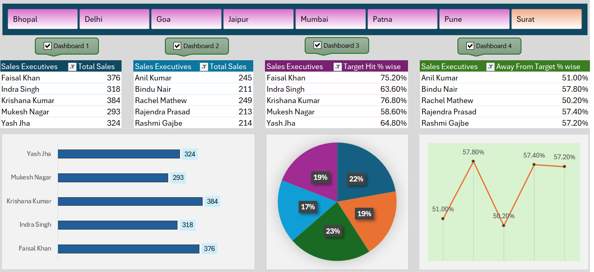

## Dashboard preview

# Sales Performance Dashboard (Excel + VBA)

## Objective
To analyze sales performance and automate reporting tasks using Microsoft Excel and VBA.

## Dataset
Daily sales data of sales executives including region, targets, total sales, and achievement percentages.

## Tools & Technologies
- Microsoft Excel
- VBA (Macros, Custom Functions)
- Pivot Tables
- Charts & Slicers
- Conditional Formatting

## Dashboard Features
- Automated data refresh using VBA macros
- Custom VBA functions for calculations
- KPI tracking: Total Sales, Target Achievement %
- Region-wise and executive-wise performance analysis
- Interactive slicers for dynamic filtering

## Key Insights
- Identified high-performing and underperforming regions
- Highlighted executives away from sales targets
- Reduced manual reporting effort through automation

## Use Case
This dashboard supports sales managers by providing automated, accurate, and interactive performance reporting.

